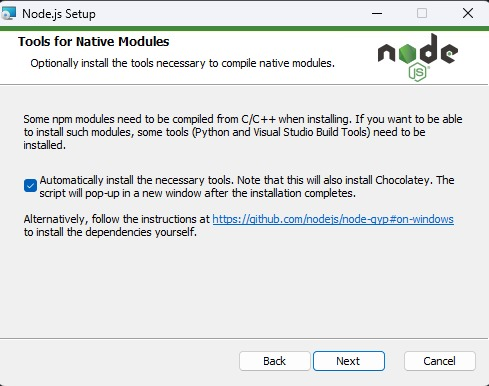
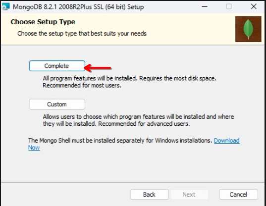
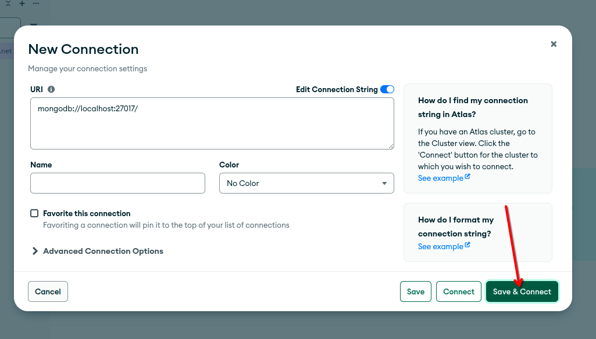
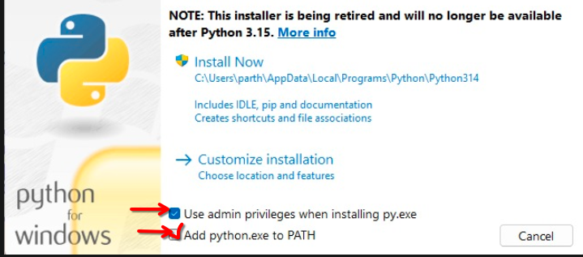
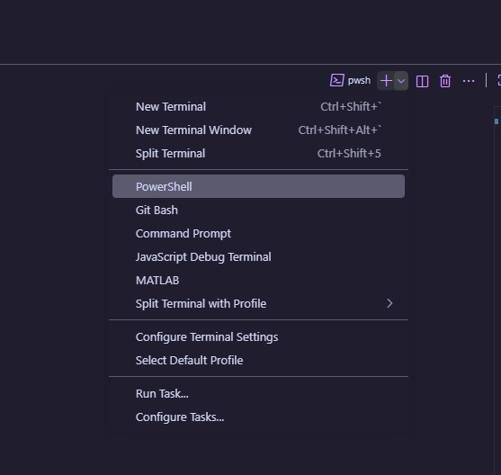

# Multi-Modal-Enterprise-Knowledge-Synthesis-Platform

# Prerequisites

- **Node.js**
- **Tesseract**
- **MongoDB**
- **Python**

## Node.js

install from https://nodejs.org/dist/v22.20.0/node-v22.20.0-x64.msi

a msi file will be downloaded. Run the installer and follow the prompts to complete the installation.
- check this option when installing


#### Verify installation
```bash
node -v
npm -v
```
if `npm -v` error's out try restarting your terminal / pc / vscode

# Tesseract
- Download the Windows installer from https://github.com/UB-Mannheim/tesseract/releases/download/v5.4.0.20240606/tesseract-ocr-w64-setup-5.4.0.20240606.exe 

- run the installer

# MongoDB

 install from https://fastdl.mongodb.org/windows/mongodb-windows-x86_64-8.2.1-signed.msi
 - run the installer and follow the prompts to complete the installation.

- an application named "MongoDB Compass" will be installed in your system. open it and follow steps to connect to your local db


- do next next next when prompted between complete and custom select complete  then next next next install



- add new connection 


- save and connect 




# Python
- Download the Windows installer from https://www.python.org/ftp/python/3.11.9/python-3.11.9-amd64.exe

- run the installer and follow check the following option when prompted
- check both options, in image one is unchecked
- please make sure you installl python from the given link to avoid clashes with other versions of python




## *Please read `core/constant.py`*
- line no 13
  - REMOTE_GPU = True,  # Use remote GPU LLMs
  - default value is true set it to false to use local gpu servers
  - set it to False to use local ollama servers


# Setting Up the  Server's

### run this script if you are in samsung's virtual machine 
 - please use power shell to run this script (right side terminal in vscode)
 - it handels error related to ssl certification in node, git, python and huggingface


```powershell
prism_vm.ps1
```

### 1. clone the repository

```bash
git clone https://github.com/bugslayer01/Knowledge-Synthesis-Platform.git
```
navigate into the project directory:
```bash
cd Knowledge-Synthesis-Platform
```

Follow these steps to set up and run the backend server:


### 2. Create a Python Virtual Environment (Please use python 3.11 for this)


It's recommended to use a virtual environment to isolate dependencies:

```bash
python -m venv virtualEnv
```


#### Activate the virtual environment:

  - **Windows (PowerShell):**
```powershell
.\virtualEnv\Scripts\activate.ps1
```
- **Windows (Terminal):**
```powershell
.\virtualEnv\Scripts\activate
```
- **Linux / macOS:**(depend on your shell)
```bash
source virtualEnv/bin/activate
```


### 2. Install Dependencies

Make sure you have `pip` updated, then install the required packages:
   
```bash
pip install -r requirements.txt

```
### 3. Please rename .env.example to .env file in project root
### 4. create models and run 2 instances of ollama for parallel processing
 - Open Terminal 
   ```bash
   OLLAMA_HOST=0.0.0.0:11435 OLLAMA_KEEP_ALIVE=-1 ollama serve
   ```
- Open new terminal 
  ```bash
   OLLAMA_HOST=0.0.0.0:11434 OLLAMA_KEEP_ALIVE=3m ollama serve
   ```
- load and make custome models
    - if you are running this for the first time please run the following command to setup the models
    ```bash
    ./setmodel.sh
    ```
 - to change parameters of models plese edit these files  
    - for gpt oss 
    - for qwen3
    - run this to apply changes
      ```bash
      ./setmodel.sh
      ```
### 4. Start the Server

run the FastAPI server: 
make sure that virtual environment is activated

```bash
python backend.py
```

The server will start at:

```
http://0.0.0.0:3000
```

# Frontend Setup

Follow these steps to set up and run the frontend server:

open a new terminal and run frontend.py
```bash
python frontend.py
```


